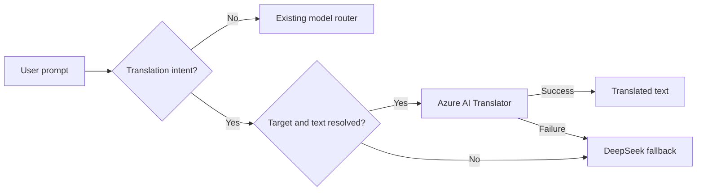

# Azure AI Translator Integration

## Summary

The application routes ordinary text translation tasks to Azure AI Translator
instead of treating every translation as a general-purpose model request.

The implementation reuses the existing `ms-tech-demo-resource-we` Azure AI
Services S0 account. No new Azure resource or API key was created.

## Saved Baseline And Feature Branch

- Voice Live baseline commit: `9c64fb2`
- Feature branch: `feature/azure-ai-translator`

The feature branch was created after the Voice Live changes were committed, so
the Translator work can be reviewed or reverted independently.

## Routing Behavior



Examples handled by Azure AI Translator:

- `Translate to Polish: Hello, how are you?`
- `Translate "Good morning" into Japanese`
- `Translate from English to French: Cloud routing is useful.`
- `How do you say thank you in Turkish?`
- `translate it to Azeri now`

For pronoun follow-ups such as `translate it`, the backend uses the most recent
assistant message from the supplied chat history as the source text.

Requests without enough structured information fall back to DeepSeek. This
preserves conversational flexibility without guessing source text or language.

## Authentication And Networking

Production uses the App Service system-assigned managed identity.

Required role on `ms-tech-demo-resource-we`:

- `Cognitive Services User`

The role was already assigned to App Service principal:

`067259fd-bc2e-48cc-bea8-a5421771f079`

The Azure AI Services account has public network access disabled. Translator
calls use:

1. App Service VNet integration through `snet-appservice-integration`.
2. Private endpoint `pe-mstech-demo-foundry`.
3. Private DNS zone `privatelink.cognitiveservices.azure.com`.

A local request to the public hostname correctly returns HTTP 403. Requests from
the deployed App Service resolve through the private endpoint and succeed.

## Configuration

```dotenv
TRANSLATOR_ENABLED=true
TRANSLATOR_ENDPOINT=https://ms-tech-demo-resource-we.cognitiveservices.azure.com/
TRANSLATOR_REGION=westeurope
TRANSLATOR_API_VERSION=3.0
TRANSLATOR_TIMEOUT_SECONDS=15
```

Optional local key authentication:

```dotenv
USE_MANAGED_IDENTITY=false
TRANSLATOR_KEY=your-translator-key
```

When `TRANSLATOR_KEY` is absent, local key authentication falls back to
`AZURE_OPENAI_KEY` because the app uses a multi-service Azure AI account.

## Code Changes

- `backend/app/translation_service.py`
  - Parses common translation prompt forms.
  - Maps language names to Translator language codes.
  - Resolves `it`, `this`, and `that` from recent assistant history.
  - Calls Translator Text API `3.0`.
- `backend/app/azure_auth.py`
  - Adds managed identity and API-key Translator headers.
- `backend/app/router_logic.py`
  - Intercepts translation intent before model execution.
  - Returns `Azure-AI-Translator` as `modelUsed`.
  - Falls back to DeepSeek for ambiguous requests or service errors.
- `frontend/src/App.jsx`
  - Clears the visible loading state when the assistant answer arrives.
  - Refreshes the conversation sidebar without retaining the Thinking card.
- `deploy.sh` and `backend/.env.example`
  - Configure and describe Translator settings.

## Validation

Backend unit tests:

```bash
PYTHONPATH=backend/.python_packages/lib/site-packages:backend \
python3.12 -m unittest discover -s backend/tests -v
```

Test coverage:

- Target language before source text.
- Target language after quoted source text.
- Explicit source and target languages.
- Ambiguous request detection.
- Translator REST request headers and response parsing.
- Successful service routing.
- Service failure fallback.
- Conversational `translate it` resolution.

Frontend build:

```bash
cd frontend
npm run build
```

Production verification:

```text
Prompt: translate it to Azeri now
Previous assistant: Cześć, jak się masz?
Model: Azure-AI-Translator
Detected source: pl
Answer: Salam necəsiz?
```

The backend deployment completed with App Service status `RuntimeSuccessful`.

## Deployment Notes

The App Service startup command references both:

- `/home/site/wwwroot/python_packages/lib/site-packages`
- `/home/site/wwwroot/.python_packages/lib/site-packages`

Small source-only deployments are used after dependencies are established. This
avoids repeatedly uploading the full dependency tree.

The Static Web Apps workflow now supports `workflow_dispatch`. The frontend
loading fix should be deployed through GitHub Actions so the Azure deployment
token remains inside GitHub Secrets. A direct local deployment with downloaded
npm code was deliberately not used.

## Operational Checks

If Translator falls back unexpectedly:

1. Confirm `TRANSLATOR_ENABLED=true`.
2. Confirm the endpoint uses the Azure AI Services custom domain.
3. Verify the App Service identity has `Cognitive Services User`.
4. Verify VNet integration and the Foundry private endpoint.
5. Check private DNS for `privatelink.cognitiveservices.azure.com`.
6. Review App Service logs for Translator HTTP status codes.

If a prompt is ambiguous, use:

`Translate to Polish: <text>`
