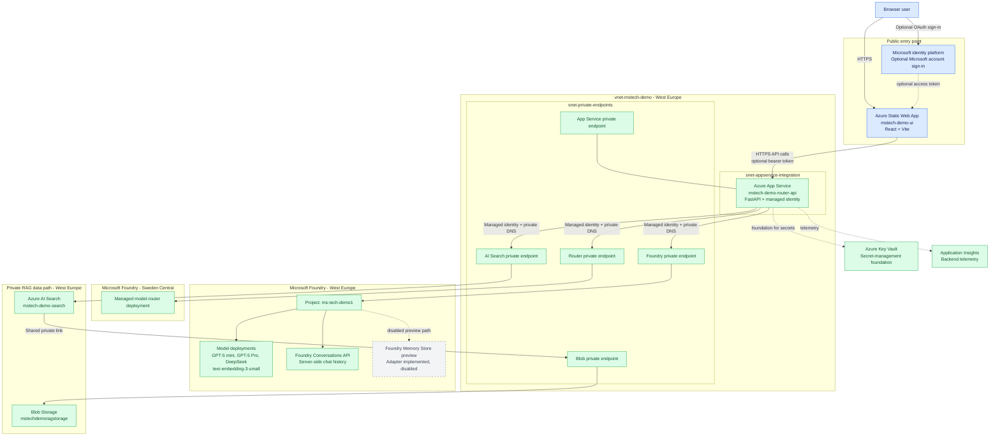
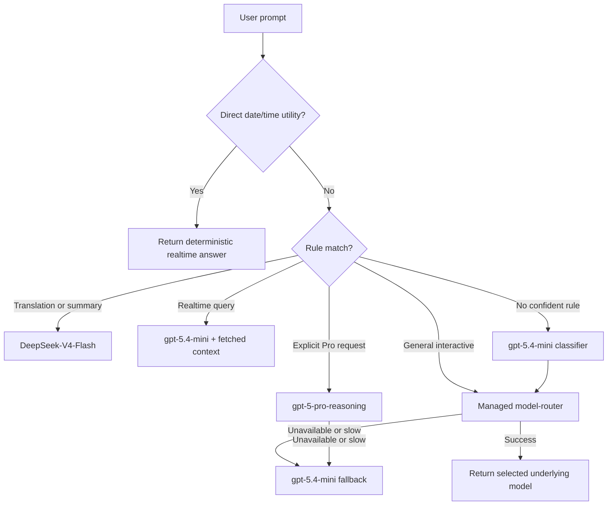
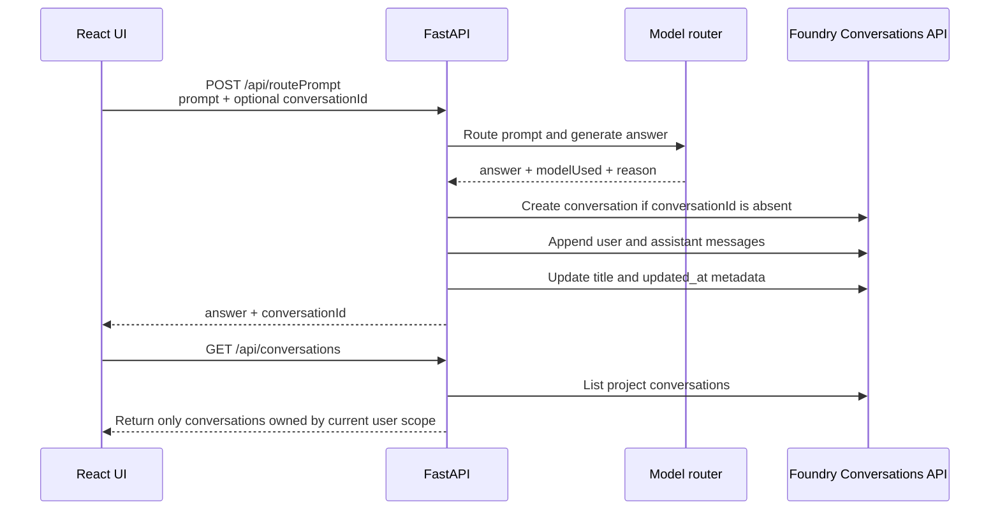
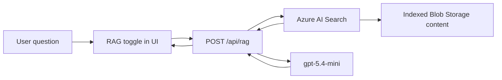
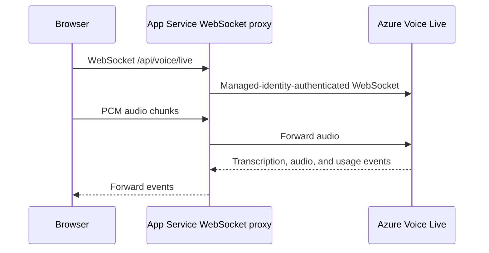

# MS Tech Demo Solution Architecture

Last updated: 2026-06-02

This is the living architecture document for the `ms-tech-demo1` solution. Update it
whenever a feature changes the deployed architecture, security model, data flow,
configuration, operational behavior, or user experience.

## 1. Solution Goals

The demo shows an Azure-native AI application architecture with:

- Public web delivery through Azure Static Web Apps.
- A private-network-integrated Python API on Azure App Service.
- Microsoft account sign-in with optional anonymous demo access.
- Managed identity for Azure service-to-service authentication.
- Hybrid multi-model routing with deterministic rules and the managed Microsoft
  Foundry `model-router`.
- Private retrieval-augmented generation (RAG) using Azure AI Search and Blob Storage.
- Voice Live support through the backend WebSocket proxy.
- Durable ChatGPT-style conversation history using the Microsoft Foundry
  Conversations API.
- An implemented but disabled Microsoft Foundry Memory Store adapter for future
  cross-conversation preference recall.

## 2. Current Deployment Status

| Capability | Status | Notes |
|------------|--------|-------|
| Static Web App frontend | Active | Public entry point |
| App Service backend | Active | HTTPS API, VNet-integrated |
| Microsoft account sign-in | Active | Personal Microsoft and organizational Entra accounts |
| Anonymous access | Active | Retained for demo visitors |
| Hybrid model routing | Active | Deterministic rules plus managed `model-router` |
| RAG | Active | Azure AI Search index backed by private Blob Storage |
| Voice Live | Active | Browser microphone proxied through App Service |
| Foundry Conversations API | Active | Replaces browser-stored chat history |
| Foundry Memory Store | Disabled | Adapter exists, but preview endpoint returned placeholder sample memories |

## 3. High-Level Architecture



The Static Web App remains public by design. Backend-to-Azure service traffic uses
private networking where supported. Public access is disabled for private backend
resources. Solid arrows show active request or data paths. Dotted arrows show
optional, supporting, or currently disabled paths.

## 4. Deployed Azure Resources

Primary resource group: `rg-ms-tech-demo1`

| Resource | Name | Region | Purpose |
|----------|------|--------|---------|
| Azure Static Web App | `mstech-demo-ui` | West Europe | Public React frontend |
| App Service plan | `plan-mstech-demo` | West Europe | Linux hosting plan |
| App Service | `mstech-demo-router-api` | West Europe | Python FastAPI backend |
| Virtual network | `vnet-mstech-demo` | West Europe | Private service connectivity |
| Blob Storage account | `mstechdemoragstorage` | West Europe | RAG source documents |
| Azure AI Search | `mstech-demo-search` | West Europe | RAG index and retrieval |
| Key Vault | `kv-mstech-demo` | West Europe | Secret-management foundation |
| Foundry AIServices account | `ms-tech-demo-resource-we` | West Europe | Main models and project |
| Foundry project | `ms-tech-demo1` | West Europe | Conversations and main Foundry APIs |
| Foundry AIServices account | `ms-tech-demo1-router-se` | Sweden Central | Managed router experiment |
| Foundry project | `ms-tech-demo1-router` | Sweden Central | Router deployment project |
| App Insights | `mstech-demo-router-api` | West Europe | Backend telemetry |

Rollback resources are retained in Sweden Central:

| Resource | Name | Region | Notes |
|----------|------|--------|-------|
| Foundry AIServices account | `mstech-demo-resource` | Sweden Central | Previous model account |
| Foundry project | `mstech-demo` | Sweden Central | Previous project |

## 5. Private Networking

The VNet uses:

| Subnet | Address space | Purpose |
|--------|---------------|---------|
| `snet-appservice-integration` | `10.42.1.0/24` | App Service outbound VNet integration |
| `snet-private-endpoints` | `10.42.2.0/24` | Private endpoints |

Private endpoints:

| Endpoint | Target |
|----------|--------|
| `pe-mstech-demo-router-api` | App Service |
| `pe-mstech-demo-search` | Azure AI Search |
| `pe-mstech-demo-ragstorage-blob` | Blob Storage |
| `pe-mstech-demo-foundry` | West Europe Foundry AIServices account |
| `pe-ms-tech-demo1-router-se` | Sweden Central router AIServices account |

Private DNS zones linked to `vnet-mstech-demo`:

```text
privatelink.azurewebsites.net
privatelink.search.windows.net
privatelink.blob.core.windows.net
privatelink.cognitiveservices.azure.com
privatelink.openai.azure.com
privatelink.services.ai.azure.com
```

Azure AI Search uses shared private link
`spl-mstech-demo-ragstorage-blob` to read indexed documents from Blob Storage.

## 6. Identity and Access

### 6.1 User Authentication

The frontend uses MSAL and app registration:

```text
Display name: ms-tech-demo1-login
Client ID: ead1d8be-064b-4e75-af9b-66ab0c28a954
Audience: AzureADandPersonalMicrosoftAccount
Scope: api://ead1d8be-064b-4e75-af9b-66ab0c28a954/access_as_user
```

Supported sign-in types:

- Personal Microsoft accounts such as Outlook.com.
- Organizational Microsoft Entra work or school accounts.

The backend validates:

- Bearer-token structure.
- JWT signature using Microsoft identity platform signing keys.
- Audience.
- Issuer and tenant relationship.
- `access_as_user` delegated scope.

`AUTH_REQUIRED=false` keeps anonymous demo access available. When authentication is
enforced later, set `AUTH_REQUIRED=true`.

Because authentication is optional for this demo, the frontend fails open when an
MSAL silent token refresh is unavailable. It also retries once without the optional
token if the API rejects a token with `401`. The anonymous browser UUID then remains
the conversation-ownership scope. Set `AUTH_REQUIRED=true` and remove this fallback
before treating sign-in as an authorization boundary for production.

### 6.2 User Scope

The backend calculates a user scope for conversation ownership and future memory:

```text
Signed-in user: entra:{tenant-id}:{subject-id}
Anonymous user: browser-generated UUID sent as X-Memory-User-ID
```

The browser UUID is stored locally only to preserve an anonymous visitor's
server-side conversation list across refreshes. Chat messages themselves are no
longer stored in browser `localStorage`.

### 6.3 Service-to-Service Authentication

The App Service system-assigned managed identity authenticates to Azure services.
Its principal ID is:

```text
067259fd-bc2e-48cc-bea8-a5421771f079
```

The identity has Foundry and Cognitive Services roles required by the model and
project APIs. Azure AI Search also uses managed identity in production.

No model API keys are embedded in the application source.

## 7. Model Deployments

### 7.1 West Europe Main Account

Foundry AIServices account: `ms-tech-demo-resource-we`

| Deployment | Model | Version | Capacity |
|------------|-------|---------|----------|
| `gpt-5.4-mini` | `gpt-5.4-mini` | `2026-03-17` | 500 |
| `gpt-5-pro-reasoning` | `gpt-5-pro` | `2025-10-06` | 100 |
| `DeepSeek-V4-Flash` | `DeepSeek-V4-Flash` | `2026-04-23` | 20 |
| `text-embedding-3-small` | `text-embedding-3-small` | `1` | 10 |

### 7.2 Sweden Central Managed Router

Foundry AIServices account: `ms-tech-demo1-router-se`

| Deployment | Version | SKU | Capacity |
|------------|---------|-----|----------|
| `model-router` | `2025-11-18` | `GlobalStandard` | 10 |

The router account is private-networked and public network access is disabled.

## 8. Prompt Routing Flow



Routing summary:

| Prompt type | Route |
|-------------|-------|
| Translation | `DeepSeek-V4-Flash` |
| Summary | `DeepSeek-V4-Flash` |
| Explicit deep reasoning request | `gpt-5-pro-reasoning` |
| Realtime query | `gpt-5.4-mini` with fetched external context |
| General interactive query | Managed Foundry `model-router` |
| Managed router failure | `gpt-5.4-mini` fallback |

The UI displays the selected model and routing explanation below each answer.

## 9. Conversation History

### 9.1 Purpose

Chat history now works like a lightweight ChatGPT conversation list:

- Each first prompt creates a Foundry conversation.
- The conversation receives a stable `conv_...` ID.
- User and assistant messages are appended server-side.
- The left sidebar lists prior conversations.
- Selecting a conversation loads its messages.
- Deleting a conversation removes it from Foundry.

### 9.2 Flow



### 9.3 Ownership Filtering

The Foundry Conversations API is project-level. The backend stores
`owner_scope` metadata on each conversation and filters list, load, and delete
operations by that value.

The frontend never calls Foundry directly. All Foundry access remains behind App
Service and managed identity.

## 10. Long-Term Foundry Memory Store

The Foundry Memory Store adapter is implemented in `backend/app/memory_service.py`.
Its intended flow is:

1. Search relevant profile and summary memories before model routing.
2. Add bounded memory context as a system message.
3. Submit the completed turn for asynchronous memory extraction.
4. Poll accepted update operations.
5. Allow scoped memory search and deletion.

Current production setting:

```text
MEMORY_STORE_ENABLED=false
```

Reason: the West Europe preview endpoint accepted requests but returned Microsoft
placeholder sample memories even after deleting an isolated test scope. Enabling
those entries could inject incorrect context into model responses.

Foundry Conversations remain enabled because their create, list, load, and delete
lifecycle was validated successfully with real persisted records.

## 11. RAG Flow



The Azure AI Search index is:

```text
rag-1779444354799
```

The native Search indexer schedule was removed. Indexing runs on demand to reduce
cost. Azure AI Search native schedules do not support a ten-day interval; use an
external private-network-compatible trigger if ten-day automation is required.

## 12. Voice Live Flow



The backend keeps Voice Live credentials off the public browser.

## 13. Backend API

| Method | Endpoint | Purpose |
|--------|----------|---------|
| `GET` | `/health` | Backend health |
| `POST` | `/api/routePrompt` | Route prompt and persist chat turn |
| `GET` | `/api/conversations` | List current user's Foundry conversations |
| `POST` | `/api/conversations` | Create an empty conversation |
| `GET` | `/api/conversations/{id}` | Load one owned conversation |
| `DELETE` | `/api/conversations/{id}` | Delete one owned conversation |
| `POST` | `/api/rag` | Answer using Azure AI Search grounding |
| `WS` | `/api/voice/live` | Voice Live browser proxy |
| `GET` | `/api/memory/status` | Memory Store adapter status |
| `GET` | `/api/memory/search` | Inspect scoped memories |
| `POST` | `/api/memory/reset` | Delete scoped memories |

## 14. Important Application Settings

| Setting | Production value | Purpose |
|---------|------------------|---------|
| `USE_MANAGED_IDENTITY` | `true` | Use App Service managed identity |
| `AZURE_OPENAI_ENDPOINT` | `https://ms-tech-demo-resource-we.cognitiveservices.azure.com/` | Main model endpoint |
| `FOUNDRY_ROUTER_ENDPOINT` | `https://ms-tech-demo1-router-se.cognitiveservices.azure.com/` | Managed router endpoint |
| `FOUNDRY_ROUTER_MODEL` | `model-router` | Managed router deployment |
| `FOUNDRY_PROJECT_ENDPOINT` | `https://ms-tech-demo-resource-we.services.ai.azure.com/api/projects/ms-tech-demo1` | Conversations and Memory Store API |
| `FOUNDRY_CONVERSATIONS_ENABLED` | `true` | Persist server-side chat conversations |
| `MEMORY_STORE_ENABLED` | `false` | Disable preview placeholder context |
| `AUTH_CLIENT_ID` | `ead1d8be-064b-4e75-af9b-66ab0c28a954` | Microsoft account sign-in app |
| `AUTH_REQUIRED` | `false` | Allow anonymous demo visitors |
| `AZURE_SEARCH_ENDPOINT` | `https://mstech-demo-search.search.windows.net` | RAG Search endpoint |

## 15. Deployment and CI/CD

Pushes to `main` trigger:

- `.github/workflows/azure-static-web-apps-orange-hill-0db554803.yml`
- `.github/workflows/main_mstech-demo-router-api.yml`

The backend workflow:

1. Installs Python requirements.
2. Installs App Service dependencies into `.python_packages/lib/site-packages`.
3. Creates an explicit ZIP package so hidden dependencies are included.
4. Deploys the ZIP to App Service.

The explicit ZIP step is required. Deploying the backend directory directly omitted
`.python_packages`, causing App Service startup failures because `uvicorn` was missing.

When deploying the frontend manually, set the production Vite environment variables
before running `npm run build`. Vite embeds these values into the browser bundle at
build time:

```bash
VITE_API_URL=https://mstech-demo-router-api.azurewebsites.net \
VITE_ENTRA_CLIENT_ID=ead1d8be-064b-4e75-af9b-66ab0c28a954 \
VITE_ENTRA_API_SCOPE=api://ead1d8be-064b-4e75-af9b-66ab0c28a954/access_as_user \
npm run build
```

Deploying a locally built bundle without `VITE_API_URL` makes the browser use the
development fallback `http://localhost:8000`, which appears as `Network Error` in
the hosted frontend.

## 16. Validation Record

Validated on 2026-06-02:

- Static Web App returned `200`.
- Backend health returned `{"status":"ok","service":"mstech-router"}`.
- App Service used managed identity for Foundry calls.
- Managed `model-router` selected underlying models successfully.
- CORS allowed the Static Web App origin for authenticated conversation calls.
- Foundry conversation creation returned a real `conv_...` ID.
- Foundry conversation list returned the created record.
- Foundry conversation load returned both user and assistant messages.
- Foundry conversation delete removed the isolated record.
- An empty isolated scope returned an empty conversation list after deletion.
- Long-term Memory Store remained disabled.

## 17. Known Limitations

- Foundry Memory Store is preview and currently returns placeholder sample memories
  for this project endpoint.
- App Service `B1` deployment cold starts are slow because Oryx packages and extracts
  Python dependencies. Deployments can take several minutes.
- `gpt-5-pro-reasoning` can exceed the demo request window; use it only for explicit
  Pro prompts.
- The conversation sidebar is desktop-first and hidden below the `md` breakpoint.
- Anonymous visitors retain a browser UUID. Signed-in users receive identity-bound
  ownership scopes.
- Optional Microsoft authentication intentionally falls back to the anonymous
  browser scope when silent token acquisition or validation fails. This preserves
  demo availability but must be tightened before production authorization use.

## 18. Documentation Maintenance Rule

For every future feature:

1. Update this file in the same commit as the implementation.
2. Update the capability status table.
3. Update diagrams and flows when a data path changes.
4. Update settings, endpoints, security assumptions, and known limitations.
5. Record validation performed after deployment.

## 19. References

- [Microsoft Foundry Conversations REST API](https://learn.microsoft.com/en-us/azure/foundry/reference/foundry-project)
- [Microsoft Foundry Memory Store preview](https://learn.microsoft.com/en-us/azure/foundry/agents/how-to/memory-usage)
- [Microsoft Entra identity platform](https://learn.microsoft.com/en-us/entra/identity-platform/)
- [Azure App Service VNet integration](https://learn.microsoft.com/en-us/azure/app-service/overview-vnet-integration)
- [Azure Private Endpoint DNS](https://learn.microsoft.com/en-us/azure/private-link/private-endpoint-dns)
