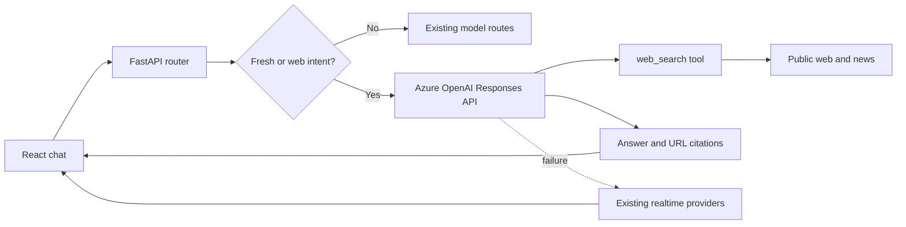

# Microsoft Foundry Web IQ

## Purpose

Web IQ adds fresh public-web grounding to the MS Tech Demo. It uses the Azure
OpenAI Responses API `web_search` tool for prompts where current information
matters, including:

- Web pages and recent news
- Current events, prices, weather, schedules, and other changing facts
- Public pages that contain images or videos
- Explicit requests to search or browse the web

Web IQ returns a generated answer plus clickable source URLs. It does not
download or inspect image/video binaries. Existing image generation and image
understanding routes remain separate.

## Request Flow



## Implementation

- `backend/app/web_iq_service.py` owns the Responses API call and citation
  extraction.
- `backend/app/router_logic.py` sends freshness-sensitive and explicit web
  prompts to Web IQ.
- `RoutingResponse.sources` carries citations through the existing API
  contract.
- `frontend/src/components/MessageList.jsx` displays up to five deduplicated,
  clickable sources.
- Existing weather, finance, RSS, and model routes remain the fallback.

## Configuration

| Setting | Purpose |
| --- | --- |
| `WEB_IQ_ENABLED` | Enables Web IQ routing when `true` |
| `WEB_IQ_ENDPOINT` | Azure AI Services endpoint in a Responses API region |
| `WEB_IQ_MODEL` | Supported model deployment, defaulting to `ROUTER_MODEL` |
| `WEB_IQ_SEARCH_CONTEXT_SIZE` | Search depth: `low`, `medium`, or `high` |
| `WEB_IQ_COUNTRY` | Optional approximate ISO country context |
| `WEB_IQ_TIMEOUT_SECONDS` | End-to-end Web IQ timeout |
| `WEB_IQ_MAX_SOURCES` | Maximum citations returned to the frontend |

The intended endpoint is the existing Sweden Central account:

```text
https://mstech-demo-resource.cognitiveservices.azure.com/
```

It already contains the `gpt-5.4-mini` deployment. No new model deployment or
AI Services account is required.

## Azure Status On June 7, 2026

- The main West Europe account
  `ms-tech-demo-resource-we` rejected the Responses API because that API is not
  enabled in West Europe.
- The existing Sweden Central account `mstech-demo-resource` has a compatible
  `gpt-5.4-mini` deployment and available quota.
- Public network access was explicitly approved and enabled on
  `mstech-demo-resource` on June 7, 2026. Its network ACL default action is
  `Allow`.
- The App Service managed identity has `Cognitive Services OpenAI User`,
  `Cognitive Services User`, and `Foundry User` on the Sweden Central account.
- A live Responses API `web_search` request completed successfully before the
  application feature was enabled.
- Production uses `WEB_IQ_ENABLED=true` with the Sweden Central endpoint.

When private endpoints are restored, this public access can be disabled again
after the private DNS and App Service network path are verified.

## Privacy And Cost

- Search queries are sent to Bing to retrieve public-web results. Microsoft
  documents that this processing is outside the Azure compliance and
  geographic boundary and is governed by the Grounding with Bing terms.
- Each Web IQ call incurs model token charges and web-search tool charges.
- Only freshness-sensitive or explicit web prompts use Web IQ; deterministic
  utilities and normal model routes do not incur a web search.
- Responses expose source links so users can verify changing claims.

## Verification

Run backend tests:

```bash
cd backend
python -m unittest discover -s tests
```

After the network path and App Service settings are enabled, verify with:

```text
What are the latest Microsoft Azure announcements today?
Search the web for recent Azure AI news and cite the sources.
Find public video pages explaining Azure AI Foundry.
```
